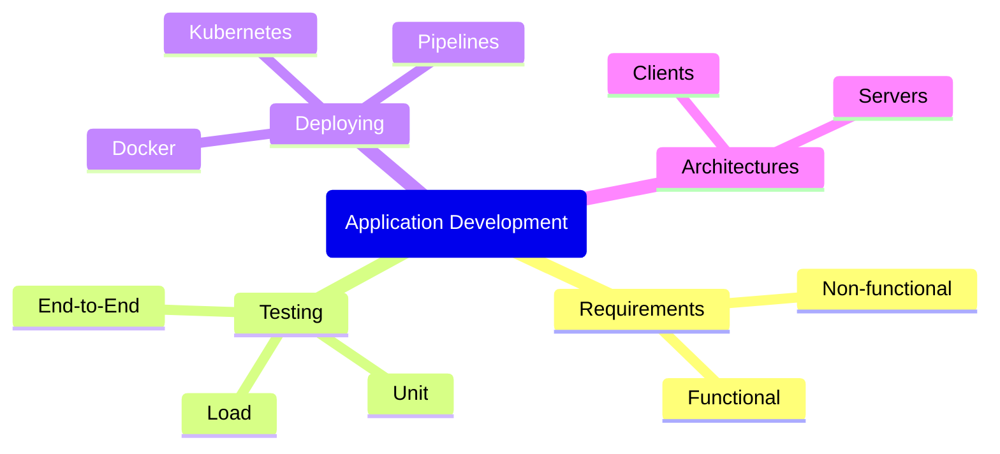

# Application Development Series: Introduction

```mermaid
mindmap
	root(Application Development)
		Requirements
			Functional
			Non-functional
		Testing
			Unit
			End-to-End
			Load
		Deploying
			Docker
			Kubernetes
			Pipelines
		Architectures
			Servers
			Clients
```
